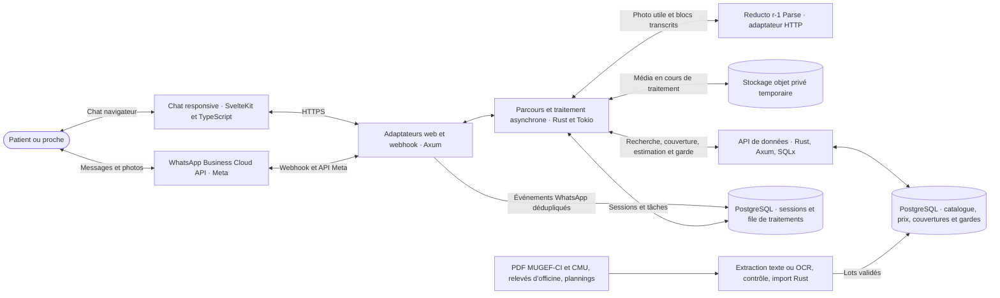

# Architecture fonctionnelle

Le web et WhatsApp utilisent le même moteur de conversation et les mêmes règles métier. Les PDF et relevés passent par un import contrôlé avant d’alimenter l’API.

```mermaid
flowchart LR
    patient(["Patient ou proche"])
    web["Chat responsive · SvelteKit et TypeScript"]
    whatsapp["WhatsApp Business Cloud API · Meta"]
    adapter["Adaptateurs web et webhook · Axum"]
    conversation["Parcours et traitement asynchrone · Rust et Tokio"]
    vision["Reducto r-1 Parse · adaptateur HTTP"]
    media[("Stockage objet privé temporaire")]
    api["API de données · Rust, Axum, SQLx"]
    db[("PostgreSQL · catalogue, prix, couvertures et gardes")]
    jobs[("PostgreSQL · sessions et file de traitements")]
    sources["PDF MUGEF-CI et CMU, relevés d’officine, plannings"]
    importData["Extraction texte ou OCR, contrôle, import Rust"]

    patient <-->|"Chat navigateur"| web
    patient <-->|"Messages et photos"| whatsapp
    web <-->|"HTTPS"| adapter
    whatsapp <-->|"Webhook et API Meta"| adapter
    adapter <--> conversation
    adapter -->|"Événements WhatsApp dédupliqués"| jobs
    conversation <-->|"Sessions et tâches"| jobs
    conversation <-->|"Média en cours de traitement"| media
    conversation <-->|"Photo utile et blocs transcrits"| vision
    conversation <-->|"Recherche, couverture, estimation et garde"| api
    api <--> db
    sources --> importData
    importData -->|"Lots validés"| db
```
